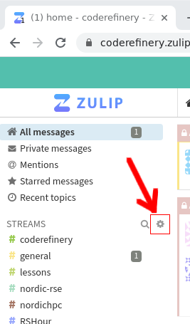

(chat)=
# CodeRefinery Zulipchat

The [CodeRefinery zulipchat](https://coderefinery.zulipchat.com) is
where our primary discussion, planning, and action takes place.  Many
things are announced only via Zulipchat.  This is a public chat and
everybody is welcome to join, no invitation needed, and we explicitly
invite anyone to give ideas in any channel or topic.

The chat is a joint community of CodeRefinery (teaching), scientific
computing teams (infrastructure and support), and Nordic-RSE (usage and software), which are other
Nordic projects about scientific computing which share some of the
same people. Together, we have a network of all aspects of modern
scientific computing.

Unlike Slack, Zulipchat is very heavily threaded, and one can follow along without being active all the time.  Respond within the
topic (=thread) that is relevant, or make a new topic.  Sometimes you
can find old topics to revive.

The [CodeRefinery Code of
Conduct](https://coderefinery.org/about/code-of-conduct/) applies to
the chat.


## Channels

Once you join the chat, you will be subscribed to some default
channels.  **The first thing you
should do is join some more channels, depending on your interest.  Join
more channels by clicking gear icon by the steams list on the left side
on that chat, then selecting what you are interested in.**



The easiest way to find channels of interest is to go through the list and join whichever sounds interesting. You can always leave a channel again too.

If you **mute a channel**, you can see the contents if you click on it,
but you won't get notifications.  If you **mute a topic**, it will be
hidden from view but you can later unmute it in your personal
settings.  Under channel settings, you can request email notifications
for all messages in a certain channel (possibly useful for the announce channels).

Default channels (everyone joining is automatically subscribed):

- #events : Share information about courses, workshops, seminars or other events; can also be used to look for collaborators
- #jobs : Share open job positions that others here might find interesting too
- #greetings : New joiners are recommended to introduce themselves here, so we can welcome you. Other greetings/thanks also welcome!
- #coderefinery : CodeRefinery organization: about the team, project, strategy, CodeRefinery Gitlab
- #nordic-rse : Nordic Research Software Engineers: General discussion about research software and related topics.
- #random : Memes, jokes, animal pictures, whatever makes you smile or does not fit any other channel :)
- #general : Ideas, TIL/W (today I learned/watched), general discussions, tech stuff, ...
- #help : Community support. Ask questions related to anything about the topics on this chat (CodeRefinery, RSE, scientific software and data, HPC,...)
- #lessons :  Discussions about CodeRefinery (and other) lessons. There's usually one topic per lesson and other related things.

There are also multiple sub-communities related to a specific event, group, region:

- #aalto : Aalto University scientific computing community (+friends)
- #aaltoscicomp : Aalto scientific computing support personnel
- #advent-of-code : For chatting about the advent of code challenges
- #cr-retreat : Temporary private channel for CodeRefinery writing retreat related discussions
- #finland : Discussion related to activities in Finland (CodeRefinery, RSE, HPC, SciComp, anything else)
- #hands-on-scicomp : Work on the https://handsonscicomp.readthedocs.io/ training map
- #hpc-kickstart : Aalto's twice-a-year kickstart courses (scicomp and HPC). Channel exists because the course is open to anyone and this is the coordination channel.
- #nordic-rse-2025 : Nordic RSE conference 2025 organization
- #python-for-scicomp : Python for SciComp coordination: A big course each autumn, public to the world. We are happy for any help here.
- #rshour : Research Software Hour community and coordination. It is a weekly livestream about research software.
- #scicomp-teams: Teams related to scientific computing, especially about running of the teams themselves. For example, HPC teams, RSE teams, data manager teams, etc.
- #SWC DLN/ELIXIR/UiB Dlab : a sub-community
- #coderefinery-tools-workshop : Where we organize the "standard" CodeRefinery workshop each spring and autumn.
- #workflows-course : Real-life cluster computing workflows course, "Tuesday tools and techniques for HPC". A new course started in 2024
- #hpc : Discussions around HPC in Nordics and beyond
- #zulip: Zulip notifications and discussions around the chat platform

New channel announcements will be visible in #general, Zulip updates can be followed in #zulip channel.

You are very welcome to create new channels, e.g. for regional subgroups, such as #finland.
You can also create topical private channels for groups that significantly
overlap with our community.  Currently, Zulip admins can't add
themselves or others to private channels.


## Good practices and tips

### Views

**Recent conversations**

To follow up on most recent conversations in chat, use `recent conversations`, which shows you all your channels, the number of unread messages per channel, starting with the most recent one.

**Combined feed**

To see all the latest messages in all your channels/topics, use `Combined feed` view.

**Or read by channel or topic**

Sometimes I see that I have many unread messages when I have been away for a while. Then I like
to "zoom into" channels and read them by channel and topic. For this I start with the channel
that I am most interested in. And I can return to the other channels later.


### Notifications

You can set separate notifications settings for the full chat, channels, and topics.


### Topic vs private message

Just want to share something with a small group of people -> Send a private message to multiple people instead of starting a new topic.


### Search before creating a new X

Use the search function to search for some relevant keywords before creating a new topic. But also don't be afraid to create a new topic.
We recommend the search first because it can nicely connect to a previous discussion and those who participated previously can be notified about
the new question or comment.


### Mark as resolved

To indicate that a topic is resolved, for example because an event happened or a help request got resolved. This does not make the topic vanish but a small checkmark is added to the topic.


### Too many unread messages?

Don't be afraid to mark all messages in a channel or topic as read if you have been away for few days or weeks.
Sometimes it can be more useful to join the current conversation rather than feeling "guilty" about not having read
everything that happened in the last weeks or days.


## Chat digest

If this chat is not your main "hang-out spot", but you would still like to stay up to date, you can sign up for the CodeRefinery chat digest, providing one e-mail per week with the latest updates from the chat.

[Sign up for the chat digest e-mail list](https://postit.csc.fi/sympa/subscribe/coderefinery-team).


## Clients

Zulipchat can be used in a web browser, there's a desktop app, mobile
apps, and even a terminal client installable using ``pip``.


(voting)=

## Reacting and voting

We want everyone to take part in chat and express their thoughts, but
of course people don't want to give pointless agreeing replies (but
you can always welcome to do that, too).  So, we encourage everyone to use reactions in cases they want to express agreement/disagreement but not so much they want to send a message.  Common reactions you might see are 👍, 👎 (thumbs up/down, agree with general sentiment), 🐙 (`:octopus:`, awesome/amazing/ace), and well, plenty more that are more obvious.

We also use reactions to express some idea of a more concrete
**vote**, to empower people to take an action (otherwise, it is
difficult to get a decision on anything).  This is not formal or
necessarily binding (so it's not really a vote), but a useful
intermediate system for a young project.  If you see a message
proposing something and you want to say, in no uncertain terms, "I
think you should do that" or not, let us know by the following:

* ↔️ (+0, `:left_right:`: I see this and am neutral.
* 🔼, 🔽 (+1, -1, `:upvote:`, `:downvote:`) or similar: I
   agree/disagree with this.
* ⏬, ⏫ (+2, -2, `:double_up:`, `:double_down:`): I agree/disagree
   with this and am willing to work on making it happen/finding an
   alternative.

If you want to do something, ask for opinions, and a reasonable time
later it seems the sentiment is positive, consider yourself empowered
to do it.  If you are voting, feel free to be creative with emojis or
numbers, but realize that other reactions may not be so explicit.  Note that if you are negative, you should explain why or alternatives, otherwise your opinion may not be weighted so much.  The person doing the thing decides what to do (and this is open source: we find a way for everyone to do what they need to do).

Do you think you aren't important enough to vote?  That's wrong,
because we are usually interested in the thoughts of everyone.  We
can see who voted and use that to weight our decision if needed.


## Privacy

All activity (except private steams) should be considered public, and
the data controller is zulipchat.com.  Zulip admins can't add
themselves or others to private channels, but still: there is no
contract guaranteeing confidentiality.

## Welcome message

Since June 2026 our welcome message to the chat is the following: 

Maybe as some page on chat management not mixed with chat usage. Could add some thoughts on why this looks like it looks. 

The current message is:

```
# Hei, Hej, Moi, Halló - and welcome!

This is the Zulip chat for the CodeRefinery and Nordic-Research Software Engineering community. We’re glad you’re here!

## TL;DR: In short - how to get started

1. Explore our [Zulip chat guide](https://coderefinery.github.io/manuals/chat/)
1. Add a profile picture and say hello in the #**greetings>Introductions**  topic
1. Follow topics/channels that match your interests and join the conversation or start your own, unfollow or mute others
1. Ask anything - no question is too small, for example in our #**help**  channel

## The slightly longer version 

### Who we are

* [CodeRefinery](https://coderefinery.org/) is a collaboration between nine Nordic organizations teaching researchers practical research software engineering skills. Our workshops and community are open to everyone. If you’re interested, you can also contribute by teaching or helping develop lessons.
  
* [Nordic-RSE](https://nordic-rse.org/) is a community and association for research software engineering enthusiasts across the Nordics and Baltics. Anyone can join discussions and attend the annual conference; and if you’d like, you can also get involved in organizing events or contributing to the association. 

* A new community that has naturally grown from the two groups above are the HPC/Scientific Computing service teams. Those are the people interested in supporting others with Scientific computing, The #**scicomp-teams**  channel provides an opportunity to connect, share experiences and ask questions.


### What’s this chat?

We use this Zulip chat as our main communication platform. If you don’t know Zulip yet, It may feel a bit different from other chats at first, but it’s great for keeping discussions organized by topic. To help you get started, here’s a quick guide: https://coderefinery.github.io/manuals/chat/

Upon joining, you’ve already been subscribed to a few channels, but there’s plenty more to explore. Feel free to browse, join, or start conversations! Best place to ask any question to the community or also just "work out loud" is our #**help**  channel. To limit the noise, you can unsubscribe and mute channels or also mute specific topics.

### A good place to start

We’d love to get to know you; if you want to, please add a picture to your profile and introduce yourself in the [#greetings>introductions](https://coderefinery.zulipchat.com/#narrow/channel/119816-greetings/topic/Introductions/with/594840612) topic. You’ll also find others’ introductions in that topic and get a sense of the community.

### Questions?

Getting into a new community can feel a bit daunting, but don’t worry; we have all been there and are happy you made it here and want to support you. If you have any questions or need help finding your way, feel free to reach out to me.

Looking forward to seeing you around, and have fun exploring! :)

-  Samantha (a community building, RSE and training enthusiast currently project manager for CodeRefinery and chair of the Nordic-RSE association)
```