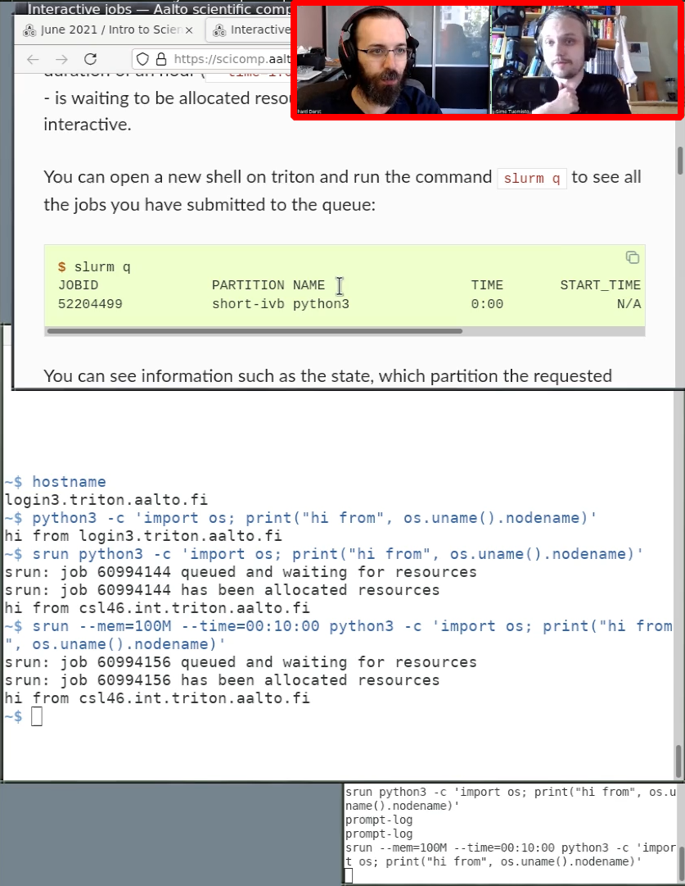

# Director

The director manages the flow of the course, and in particular the
flow when things do *not* go according to plan.  During livestream
courses, the director also manages the stream scene/audio selection.


* Gives introductions and wrap-ups (to the days, sessions, and
  instructors), or at least ensures they happen.
* Ensures good flow of the course overall
  * Is aware enough of the schedule so that they can decisively adjust
    it when needed.
  * Keeps time, ensures breaks
  * Actively discusses with the instructors about these practical
    arrangements (e.g. negotiating best break times)
* (livestreaming) Flips the livestream scenes when necessary, cues
  instructors.


## Managing the schedule

The director manages the overall flow: making sure the instructors are
ready, icebreakers happen, transitions are smooth, people are
introduced, breaks happen, HackMD is shared at the appropriate times,
and so on.

During large courses, there are many different instructors and certain
exercises/lessons may randomly take longer (no matter how much
preparation there is).  The audience expects this, and in practice
decisively accepting and adjusting the schedule (or deciding not to)
makes things smooth.

The Director is usually the instructor coordinator, so knows the
schedule well.  The instructor should be empowered to decide (after
checking chat, HackMD, and other instructors) what to do, and can
directly announce the new schedule.  This takes confidence, but don't
worry: you have plenty of people to consult with, ask advice from
those around and then make your choice.

You should also make sure that HackMD is updated with breaks,
exercises, and so on.  You will probably be the one sharing HackMD
during the breaks.


## Switching scenes and audio

During a livestream course, various video inputs are mixed
(screenshare, instructor gallery, title card, HackMD) and
broadcasted.  This gives one extra level of management that is needed:
yes, it is more overhead, but the advantages are that the instructors
can mute the livestream and have a private discussion.  This is great
for breaks and exercise times, and really helps with the flow a lot.

So, for example:
- Start the course on the "title card"
- Switch to gallery view for introduction
- Switch to screenshare (and adjust PiP size) during teaching
- Share HackMD during the break and then make PiP size zero
- Repeat for next courses.

The available controls include:

- Audio: the audio capture can be turned on and off:
  - "Instructors": the capture of the Zoom
  - "Mic": this is the *local microphone* of the capture computer and
    should not normally be adjusted.

- Scene selection: there is a button to select among these scenes
  - "Title card": graphics used before learners arrive
  - "Gallery": instructors
  - "Screenshare": capture of the Zoom screenshare
  - "Hackmd": just what it says

```{sidebar} PiP example


In the upper left of the screen you see the instructor PiP
overlaid on the HackMD screenshare.
```

- Picture in Picture display: adjust size and layout of this

	- The **size** can be adjusted to fit the screen
	- To turn it **off**, make the size zero
	- The cropping can be adjusted based on the number of people in
      the Zoom display.


## OBS remote control via obs-tablet-remote

The broadcaster will provide you with a URL to go to the remote
control.  TODO: picture

This is an example (note: it won't work, because you don't have OBS running):

- coderefinery.github.io/obs-tablet-remote/#!auto&host=127.0.0.1&port=4444&config=https://raw.githubusercontent.com/rantahar/obs-config/master/obs-tablet-remote-config.json


Go to this URL.  It will prompt you for a password (or the broadcaster
might add the password to the URL already).  The OBS remote control
will open with a pre-arranged configuration for your course, with
buttons corresponding to the controls you see above.


## See also
(none yet)
