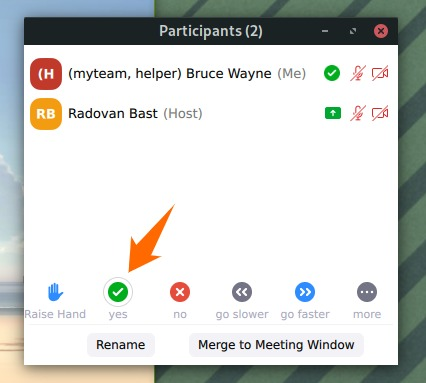
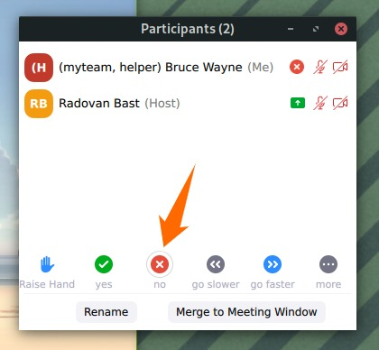

# Zoom mechanics and controls

## How to mute and unmute

In lower left corner of the client you can mute and unmute yourself:

In the *main room* during lectures, it is best to keep your microphone
muted in the main room unless you want to say something.  It's OK to
unmute and speak up.

If you are in a quiet place, it's best to stay unmuted in breakout
rooms and during active discussions.  This will make discussion much
smoother - a quiet environment or headset microphone helps with the
flow a lot.

## Please use your real name (instead of a system default username)

First, click on **"Participants"** (bottom, middle):

You can rename yourself by clicking the blue **"Rename"** next to your
name that appears when you hover over the button:

A box to rename yourself appears:

## Indicate in your name if you are in a team and/or if you are a helper

If you are part of a team, please indicate your team name or number
like `(myteam) Your Name`:

If you are a helper, please indicate like `(myteam, helper) Your Name`
also.  The workshop might use the form `(myteam,H) Your Name` instead,
check what it requests:

This makes it easier for the workshop organizers to manage breakout rooms.

## Indicating your status

### How to signal if you are away from keyboard

Please select the **"clock" symbol** if you are away or otherwise busy.
You can find this under the "more" icon in at the bottom of the
participants list:

### How to signal when you completed a task successfully

We will sometimes ask you to signal to us once you have successfully completed
an exercise or type-along step. You can do this using the **green "yes"
check symbol** under the participant list:

### How to ask a question

If you want to ask a question please use the **"raise hand" symbol**
under participant list:

If this symbol is not present in your Zoom client, you can type "\hand" in the
chat window:

### How to signal a technical problem or that you got stuck

If you hit a technical problem or got stuck somewhere in an exercise
or type-along, please let us know with the **red "no" circle symbol**:

We will then probably ask you to unmute and briefly describe the problem and then based
on the problem and timing we may assign you into a separate virtual room with a helper where
they can resolve the problem.

Once we have assigned you a helper we will ask you and the helper to **"Join
Breakout Room"** (bottom right):

### How to give feedback on the speed

There are also signals for **go faster** and **go slower** and with
this you can indicate to
us whether we should adjust the speed.

## Other points

### Zoom doesn't have to fullscreen when someone shares their screen.

By default, when someone shares their screen, Zoom goes into
fullscreen mode.  This can be inconvenient when you need to see
multiple windows at once.  You can disable this with Settings → Screen
Share → "Enter full screen when participants share".

---

This is licensed under [CC-BY](https://github.com/coderefinery/manuals/blob/master/LICENSE)
and we encourage and appreciate reuse, modifications, and contributions.
