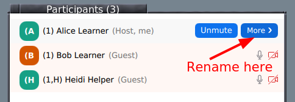

(how-to-zoom)=
# Zoom mechanics and controls

## Basics

* Most Zoom controls are probably well known by now, but if not, view
  [Zoom's basic
  guide](https://support.zoom.us/hc/en-us/articles/200941109-Participant-controls-in-a-meeting)

* **Mute** and **unmute** yourself from the buttons on bottom.
* You can **rename** yourself from the participants list (hover over
  your name.
* We don't use Zoom chat for typical questions: use HackMD instead.
  * Chat OK for administrative questions.

## Audio/video on or off?

* **Main room**: OK to have off, stay muted.
* **Breakout rooms**: Try to leave on for most interactive
  atmosphere.

## Your name should indicate your breakout room

* When joining, please use the **name you used to register for the
  course**.
* Have your breakout room number in your name:

  * **(number) Your Name**
  * **(number,H) The Name** for helpers

  

* Rename yourself in a meeting by starting participants list:

  

  Rename is found if you hover your name and click "more"

  

## Breakout rooms

* Click the "breakout rooms" button at bottom and you can join a room.

* You can click "Join" to join your own room.

  * If you are joined via web, make sure your name is correct (see
    above) and use Zoom chat to ask host to assign you to the room.

* **Return to main room**: "Leave" button at bottom has an option for
  "Return to main room".

## Reactions

We watch the participant list and can see these reactions (in the
application):

* **Task completed**: Green check
* **Technical problem**: Red X
* **Need more time**: Slower "<<"
* You can signal **go faster** and **go slower**
* You can **Raise your hand**

## Other settings

* **Automatic fullscreen when screenshare starts** can be turned off
* **Dual monitor mode** makes separate windows for screenshare and participants

## See also

* The old version of this document is available at {doc}`zoom-mechanics-old`.

---

This is licensed under [CC-BY](https://github.com/coderefinery/manuals/blob/master/LICENSE)
and we encourage and appreciate reuse, modifications, and contributions.
