# Zoom mechanics and controls

## How to mute and unmute

In lower left corner of the client you an unmute yourself if you want to say
something but please keep your microphone muted otherwise:

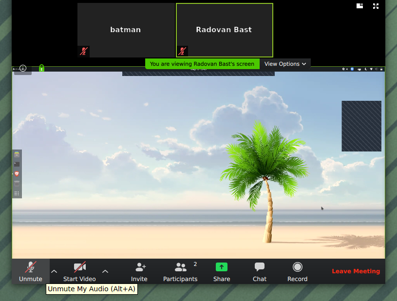

## Please use your real name (instead of a system default username)

Click on "Participants" (bottom, middle):

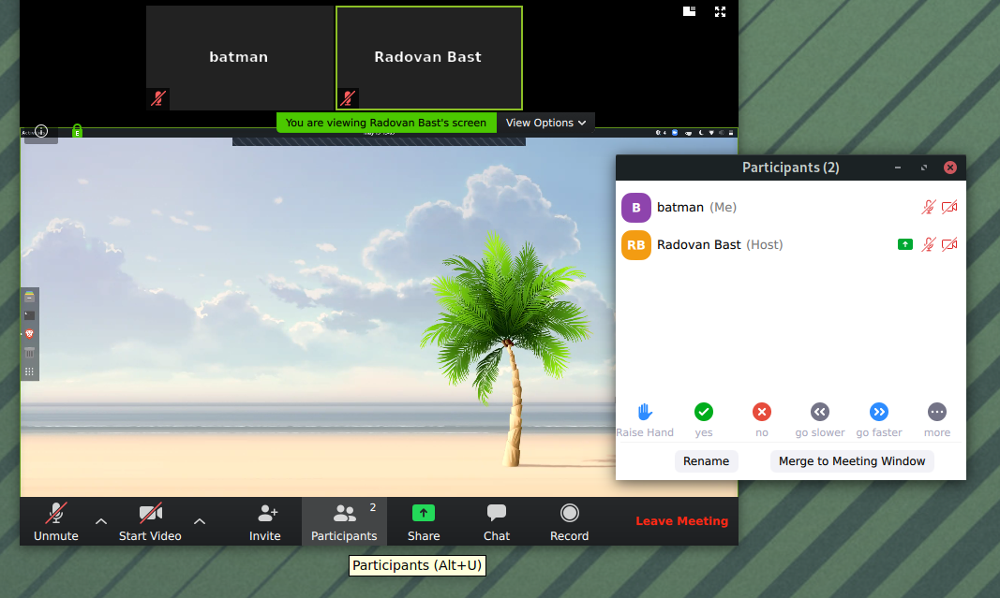

You can rename yourself by clicking the blue "Rename" next to your name:

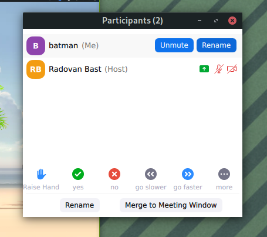

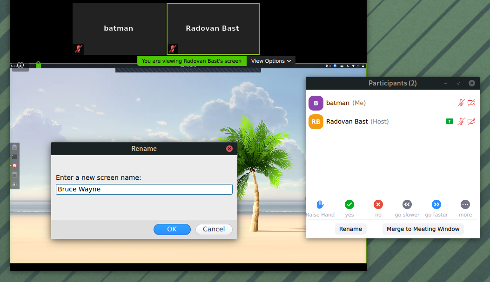

## Indicate in your name if you are in a team and/or if you are a helper

If you are part of a team, please indicate your team name or number like this:

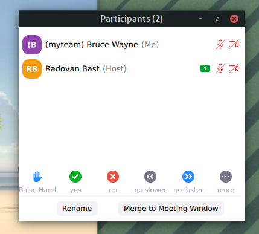

If you are a helper, please indicate also:

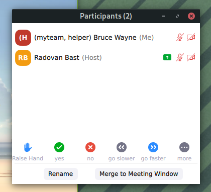

This makes it easier for the workshop organizers to manage breakout rooms.

## How to signal if you are away from keyboard

Please select the "clock" symbol if you are away or otherwise busy:

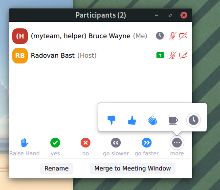

## How to signal when you completed a task successfully

We will sometimes ask you to signal to us once you have successfully completed
an exercise or type-along step. You can do this using the green check symbol:

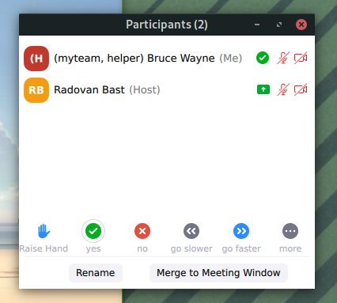

## How to ask a question

If you want to ask a question please use the "hand" symbol:

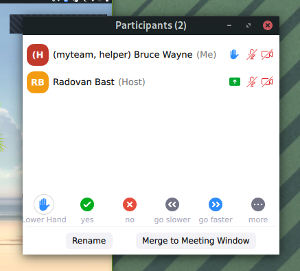

If this symbol is not present in your Zoom client, you can type "\hand" in the
chat window.

## How to signal a technical problem or that you got stuck

If you hit a technical problem or got stuck somewhere in an exercise
or type-along, please let us know:

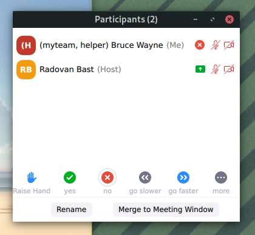

We will then probably ask you to unmute and briefly describe the problem and then based
on the problem and timing we may assign you into a separate virtual room with a helper where
they can resolve the problem.

Once we have assigned you a helper we will ask you and the helper to "Join
Breakout Room" (bottom right):

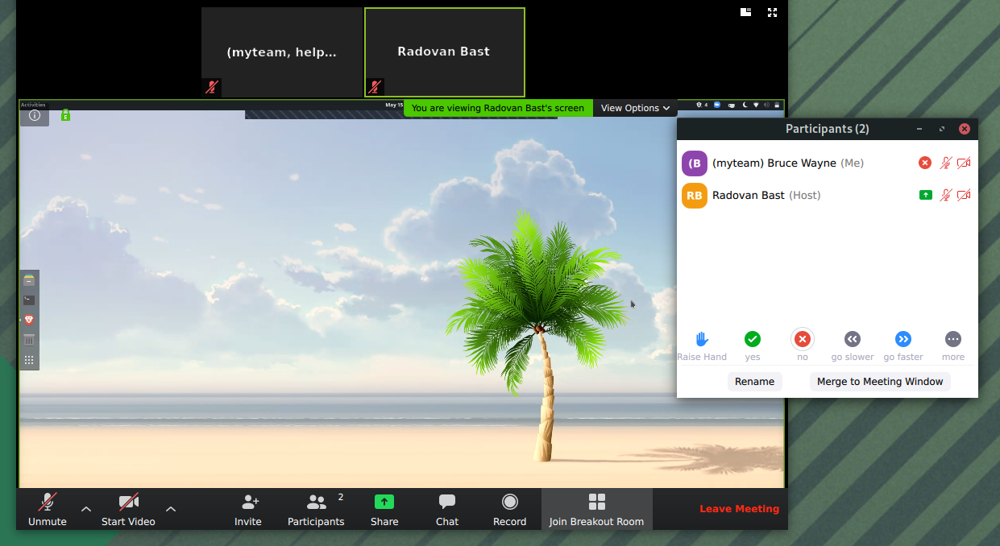

## How to give feedback on the speed

There are also signals for faster and slower and with this you can indicate to
us whether we should adjust the speed.
